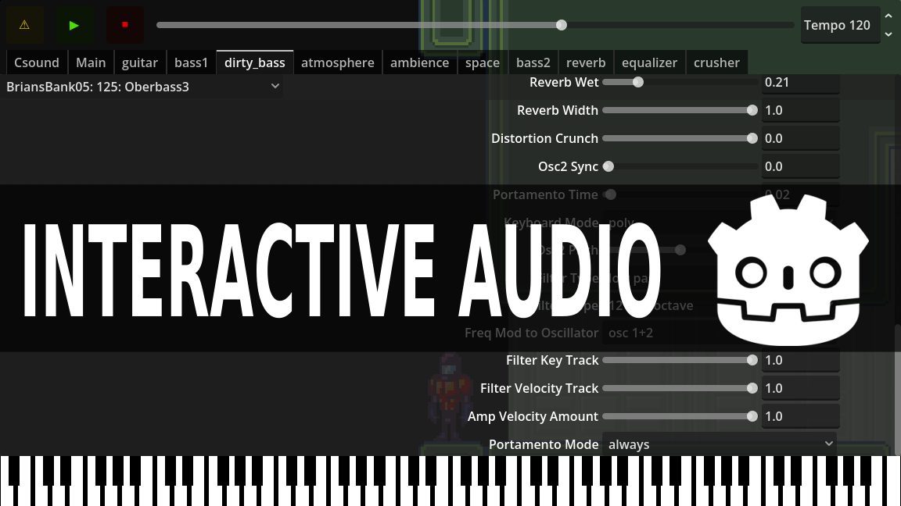
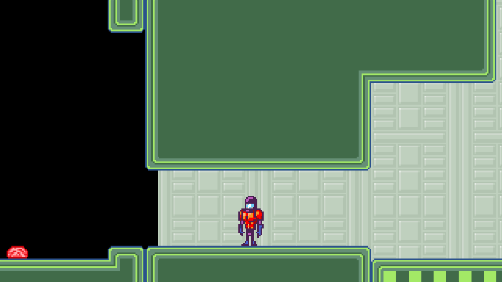
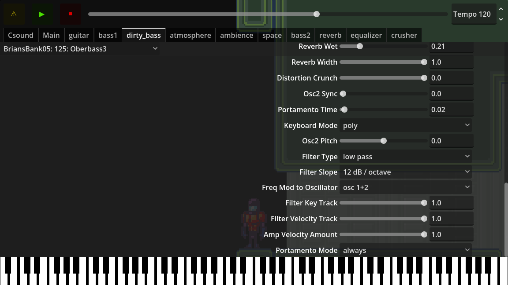
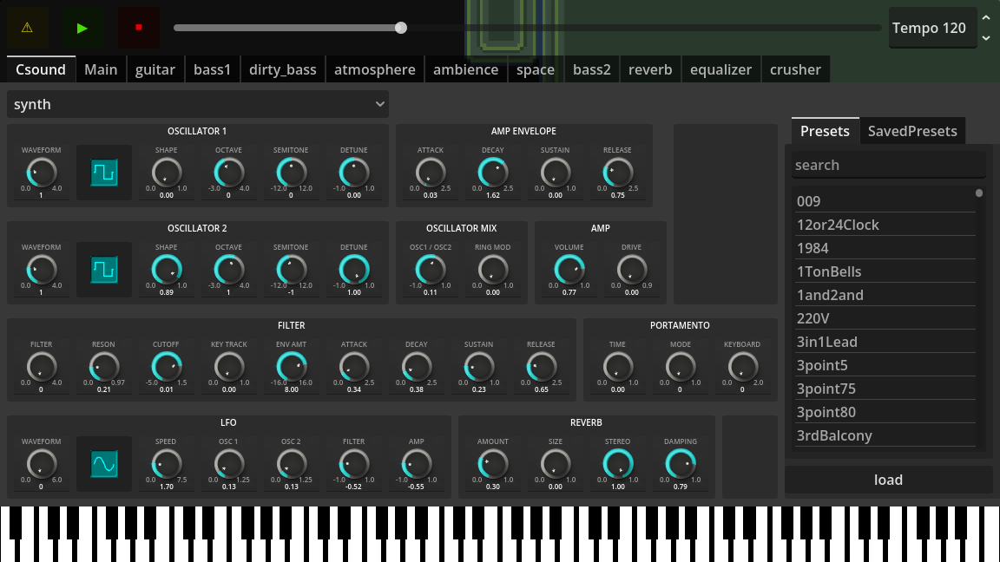

godot-interactive-audio
=======================

A demonstration of interactive audio systems in Godot, created for GodotCon 2026.

Video
-----

[](https://www.youtube.com/watch?v=s4RdpC1FSEI)

Images
------





Installation
------------

1. Download the dependencies:

```bash
godot --headless -s package.gd install
godot --headless -s plug.gd install force
```

2. Import godot resources

```bash
godot --headless --import
```
